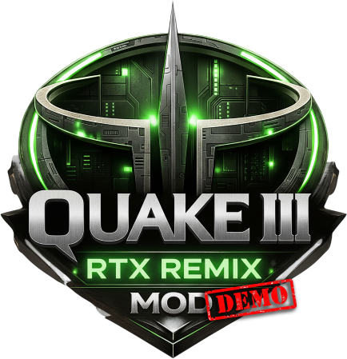
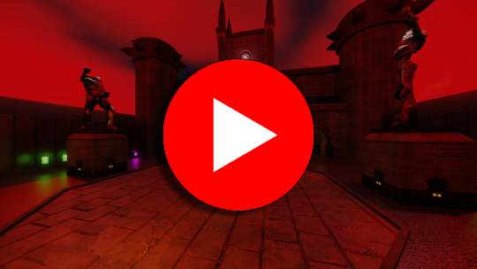

# Quake 3 Arena RTX Mod Demo

# THIS REPOSITORY IS NOT UNDER ACTIVE DEVELOPMENT ANYMORE!
# PLEASE GO TO THIS LINK FOR THE LATEST VERSION: [ModDB](https://www.moddb.com/mods/quake-3-arena-rtx-remix-mod/downloads)

  

  
  
  
  

This project is a visual enhancement mod for **Quake 3 Arena**, created using  
**RTX Remix 1.3.6**, **Quake3e**, **imgupscaler.ai**, and **Photopea**.  
It brings modern PBR-style textures and ray-tracing compatible materials to the game while keeping original gameplay completely intact.

**Intended for Singleplayer gameplay!**

**Made by: WoodBoy (aka PolyPlayBox)**

> **Note:** Only textures are remastered — **no models** have been modified yet.

> [!CAUTION]
> I dont take any responsibility for any hardware damage, VAC bans, any other problems that this mod might cause

> [!CAUTION]
> Please download the mod files from [ModDB](https://www.moddb.com/mods/quake-3-arena-rtx-remix-mod/downloads)
> or from the official github [release](https://github.com/PPBWoodBoy/q3-rtx-demo/releases/)

---

## Trailer

      
    

---

## 🔥 Remastered Content

### 🗺️ Maps
| Map   | Status |
|-------|--------|
| Q3DM1 | ✔️ Remastered Textures / Custom Lighting |
| Q3DM3 | ✔️ Remastered Textures / Custom Lighting |
| Q3DM6 | ✔️ Remastered Textures / Custom Lighting |
| Q3DM10 | ✔️ Remastered Textures / Custom Lighting |
| Q3DM17 | ✔️ Remastered Textures / Custom Lighting |
| Q3TOURNEY1 | ✔️ Remastered Textures / Custom Lighting |

### 🧑‍🚀 Player Textures
| Player | Status |
|--------|--------|
| Doom   | ✔️ |
| Ranger | ✔️ |
| Gorre  | ✔️ |
| Slash  | ✔️ |
| Ranger | ✔️ |
| Sarge | ✔️ |
| Orbb | ✔️ |
| Hossman | ✔️ |
| Daemia | ✔️ |
| Bitterman | ✔️ |
| Grunt | ✔️ |
| TankJr | ✔️ |
| Angel | ✔️ |
| Wrack | ✔️ |
| Bones | ✔️ |
| Mynx | ✔️ |
| Keel (Blue) | ✔️ |
| Sorlag | ✔️ |

### 🔫 Weapon Textures
| Weapon          | Status |
|-----------------|--------|
| Gauntlet        | ✔️ |
| Machinegun      | ✔️ |
| Shotgun         | ✔️ |
| Rocket Launcher | ✔️ |
| Railgun         | ✔️ |
| Plasmagun       | ✔️ |
| Lightninggun       | ✔️ |
| Grenade launcher       | ✔️ |

---

## 📥 Installation TL;DR

- Copy the original .pk3 files (pak0.pk3 - pak8.pk3) into the ``baseq3`` folder of the Mod
- Run `q3rtx.exe` once
- Have fun!

> [!CAUTION]
> If you happen to change a setting and cant get it solved
> here is a list of all ingame settings required to work with RTX:
> - Graphics Settings: Lighting: Vertex
> - Graphics Settings: GL extensions: On
> - Graphics Settings: Texture detail: Highest (100%)
> - Graphics Settings: Texture quality: 32 bit
> - Graphics Settings: Color depth: 32 bit
> - Game Options: Dynamic Lights: Off
> - Game Options: High Quality Sky: On

### 🛠️ Change the screen resolution (optional)

Open:`baseq3/autoexec.cfg`

Look for the following lines:

- r_customWidth "xxxx"
- r_customHeight "xxxx"

Replace `xxxx` with your resolution.  
The default included in this mod is:

- r_customWidth **"1920"**
- r_customHeight **"1080"**

### 🛠️ Shortcuts ingame

- j = Toggle HUD
- k = Toggle draw weapon
- l = Toggle Thirdperson

---

### ❗ DO NOT CHANGE ANY IN-GAME GRAPHIC SETTINGS

This is extremely important.

RTX Remix and Quake3e require specific settings already included in the config.  
Changing graphics or game options can break:

- lighting  
- reflections  
- material PBR properties  
- texture assignments  

Just launch and play.

> [!CAUTION]
> If you happen to change a setting and cant get it solved
> here is a list of all ingame settings required to work with RTX:
> - Graphics Settings: Lighting: Vertex
> - Graphics Settings: GL extensions: Off
> - Graphics Settings: Texture detail: Highest (100%)
> - Game Options: Dynamic Lights: Off
> - Game Options: High Quality Sky: On

---

## 🛠 Tools Used

### Engines & Rendering
- **NVIDIA RTX Remix 1.2.4**
- **Quake3e (latest build)**
- **opengl32.dll**

### Texture Workflow
- **imgupscaler.ai** — AI enhancement and detail restoration  
- **Upscayl** — AI enhancement and detail restoration  
- **Photopea** — manual cleanup, corrections, and texture prep  

---

## 📌 Known Limitations

- 3D objects / Models have not been remastered yet
- Textures dont have animations (mostly)
- Some textures might not be remastered or have strange roughness effects
- RTX might not hook / work if a different: Quake3e.exe, opengl32.dll or RTX Remix version is used
- UI / HUD textures are not remastered yet
- Texture Quality slider must be maxed (100%) otherwise the enhanced textures wont load!

---

## 🧭 Roadmap

- Remaster all Q3 maps / textures
- High-poly model replacements  
- Remaster UI/HUD textures 

---

## 📄 Credits

**Textures & Materials**  
WoodBoy (PolyPlayBox on YouTube)

**Tools**  
- RTX Remix  
- Quake3e  
- imgupscaler.ai  
- Upscayl
- Photopea  

**Original Game**  
© id Software — Quake III Arena (1999)

---

## 📜 License

This is a **non-commercial fan remaster project**.  
Textures are based on original id Software assets and may not be used commercially.

---

## 🙏 Special Thanks

A huge thank-you to the following people from the official **NVIDIA RTX Remix Discord server** for their help, guidance, and support during development:

- **saintMath**  
- **Ferdam**
- **Jon**
- **RuneStorm**
- **RangerXT**

Your contributions and feedback made this project possible!

---

## 🌐 Socials

- **X (Twitter):** [@WoodBoy2908](https://x.com/WoodBoy2908)
- **Discord:** [WoodBoy2908](https://discord.com/users/woodboy2908)

---

## ⭐ Support the Project

If you enjoy this RTX demo, please consider:

- ⭐ Starring the repository  
- 🖼 Sharing screenshots  
- 📝 Reporting visual issues  

Thanks for trying the demo!
